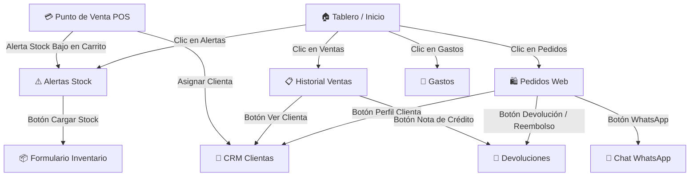

# 🚀 Plan Maestro de Super Integración UI — Ilara Beauty POS
**Documento:** `PLAN-GEMINI.MD`  
**Versión:** 1.0  
**Fecha:** 17 de Agosto de 2026  
**Objetivo:** Interconectar de forma fluida todos los módulos del sistema (POS, Inventario, Pedidos Web, CRM, Finanzas, Devoluciones y Catálogo) eliminando fricciones operativas y potenciando la experiencia de usuario (UX).

---

## 1. Visión y Principios Rectores

El sistema ya cuenta con una base arquitectónica, de base de datos y de seguridad sumamente sólida (Etapas 0 a 8 cerradas). El siguiente salto de calidad es lograr una **super integración funcional**: que cualquier dato relevante en una pantalla permita saltar a su módulo relacionado en **1 solo clic**, sin necesidad de cambiar manualmente de pestaña ni volver a buscar el registro.

### Principios:
1. **Cero fricción operativa:** Menos clics para las tareas más frecuentes del día a día.
2. **Respeto a etapas previas:** No romper ni alterar la lógica transaccional de precios autoritativos, RLS, ni la estructura de Stage 9 en curso.
3. **Navegación contextual (Deep Linking):** Si vengo de una alerta de stock, el formulario de inventario ya se abre con ese producto cargado.
4. **Omnicanalidad nativa:** WhatsApp integrado en cada hito del pedido para comunicación instantánea con la clienta.

---

## 2. Mapa de Conexiones a Implementar

---

## 3. Desglose de Fases de Implementación

---

### 📍 FASE 1: Deep Linking y Centro de Mando (Tablero & Alertas)
*Objetivo: Convertir el Tablero en un centro de control interactivo donde cada métrica sea un acceso directo.*

#### 1.1 KPIs Interactivos en el Tablero (`components/Tablero.tsx`)
- [ ] **Tarjeta "Ventas del Período":** Al hacer clic, navega a la pestaña de Ventas activando la subpestaña *Historial de Ventas*.
- [ ] **Tarjeta "Gastos del Mes":** Al hacer clic, navega a la pestaña *Gastos*.
- [ ] **Tarjeta "Bajo Stock":** Al hacer clic, navega a la pestaña *Alertas de Stock*.
- [ ] **Nueva Tarjeta "Pedidos Web Abiertos":** Muestra el conteo de pedidos en estado `pending` o `confirmed`, y al hacer clic navega a *Pedidos*.

#### 1.2 Acción Rápida desde Alertas de Reposición (`components/AlertasReposicion.tsx`)
- [ ] Agregar en cada fila de alerta el botón **"📦 Cargar Stock"** / **"Editar Producto"**.
- [ ] Al hacer clic, navega a la pestaña *Inventario*, abre el modal de edición de ese producto y enfoca el campo de stock.

---

### 📍 FASE 2: Pedidos Web 360° (CRM + Devoluciones + WhatsApp)
*Objetivo: Que el equipo gestione todo el ciclo de vida de un pedido web sin salir del panel.*

#### 2.1 Conexión de Pedidos con CRM de Clientas (`components/Pedidos.tsx`)
- [ ] En el modal de detalle del pedido:
  - Si el pedido está asociado a un `customer_id`, mostrar el botón **"👤 Ver perfil en CRM"** que navega a *Clientes* con el panel de CRM abierto para esa clienta.
  - Si no está asociada, botón **"➕ Registrar como clienta"** para sumarla al CRM con un clic.

#### 2.2 Integración Pedido → Devolución / Reembolso
- [ ] En pedidos con estado `completed` o `delivered`, agregar la acción **"🔄 Iniciar Devolución"**.
- [ ] Al hacer clic, navega a *Devoluciones*, preseleccionando el número de pedido y sus artículos.

#### 2.3 Plantillas Inteligentes de WhatsApp en Pedidos
- [ ] Agregar botón con icono de **WhatsApp** junto al teléfono de la clienta en el detalle del pedido.
- [ ] Generación automática del mensaje según el estado:
  - **Confirmado:** *"¡Hola {Nombre}! Confirmamos tu pedido {IL-XXXX}. Ya lo estamos preparando."*
  - **Listo para retirar:** *"¡Hola {Nombre}! Tu pedido {IL-XXXX} ya está listo para que pases a retirarlo por el local."*
  - **Despachado:** *"¡Hola {Nombre}! Tu pedido {IL-XXXX} fue despachado. Podés seguirlo acá: {Link}."*

---

### 📍 FASE 3: POS Aumentado e Historial de Ventas
*Objetivo: Maximizar la velocidad y fidelización de clientas en el mostrador.*

#### 3.1 Asignación de Clienta en el POS (`components/PuntoVenta/`)
- [ ] En el panel lateral del carrito del POS, incorporar un **buscador predictivo de clienta** (por nombre o teléfono).
- [ ] Permite seleccionar una clienta existente del CRM o crear una rápida para acumular sus puntos/historial de compras.
- [ ] Visualización rápida de si la clienta tiene notas internas o preferencias registradas.

#### 3.2 Historial de Ventas → Devoluciones (`components/HistorialVentas.tsx`)
- [ ] En cada fila del historial de ventas, agregar el botón **"🔄 Devolución / Nota de Crédito"**.
- [ ] Navega al módulo de devoluciones con la venta precargada para emitir la nota de crédito en segundos.

---

### 📍 FASE 4: Indicadores y Badges en Tiempo Real en el Dock
*Objetivo: Visibilidad instantánea de tareas pendientes desde cualquier pantalla.*

#### 4.1 Badges en la Barra Inferior (`app/home-page-client.tsx`)
- [ ] **Dock "Negocio":** Badge numérico si existen pedidos web pendientes de confirmación o preparación.
- [ ] **Dock "Stock":** Badge de alerta si hay productos con stock agotado (`stock = 0`).
- [ ] Actualización reactiva al cambiar de estado un pedido o al reponer inventario.

---

### 📍 FASE 5: Consistencia Visual y Microinteracciones
*Objetivo: Pulido estético, accesibilidad (A11y) y sensación de app de primer nivel.*

#### 5.1 Estandarización de Componentes Compartidos
- [ ] Asegurar que todos los modales utilicen el componente accesible [`Dialog.tsx`](file:///c:/Users/ilaan/ilara-app/components/ui/Dialog.tsx) con focus trapping y escape stack.
- [ ] Unificar los estados vacíos con [`EmptyState.tsx`](file:///c:/Users/ilaan/ilara-app/components/ui/EmptyState.tsx) (ilustraciones y botón de acción principal).
- [ ] Toasts interactivos con opción de deshacer o ver el registro recién creado.

---

## 4. Matriz de Prioridades y Cronograma Sugerido

| Sprint / Fase | Módulos Involucrados | Dificultad | Impacto en Negocio |
|---|---|:---:|:---:|
| **Sprint 1 (Fase 1)** | Tablero, Alertas de Reposición, Inventario | Baja | 🟢 Inmediato |
| **Sprint 2 (Fase 2)** | Pedidos Web, CRM Clientas, WhatsApp | Media | 🟢 Muy Alto |
| **Sprint 3 (Fase 3)** | Punto de Venta (POS), Historial de Ventas | Media | 🟢 Alto |
| **Sprint 4 (Fase 4 y 5)** | Dock Badges, A11y, Microinteracciones | Baja | 🟡 Medio |

---

## 5. Definition of Done (DoD) para cada Mejora

Para dar por concluida cada conexión:
1. ✅ **Navegación bidireccional:** Se puede ir y volver sin perder el estado ni la sesión.
2. ✅ **TypeScript estricto:** Cero errores de tipado en `tsc`.
3. ✅ **Lint & Tests limpios:** `npm run lint` y `npm run test` pasando al 100%.
4. ✅ **Mobile & Desktop responsive:** Funcionamiento impecable en pantallas táctiles y escritorio.
5. ✅ **Accesibilidad:** Uso de teclado (Tab/Escape/Enter) y atributos ARIA en todos los nuevos botones.
